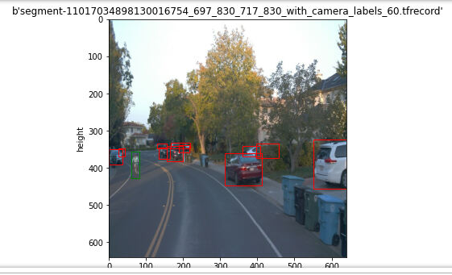
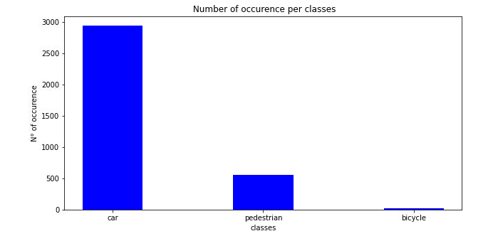
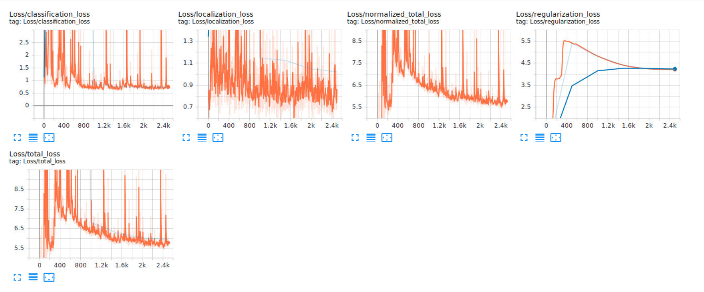
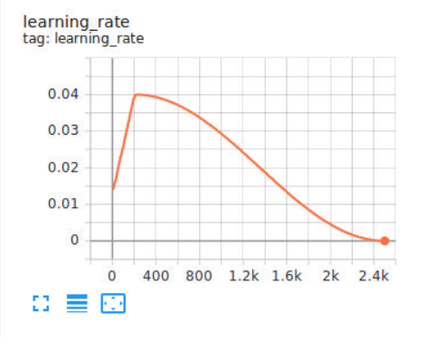
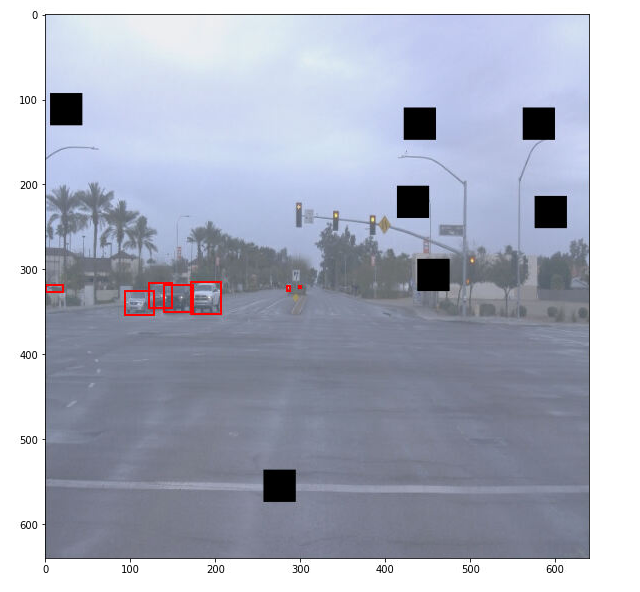
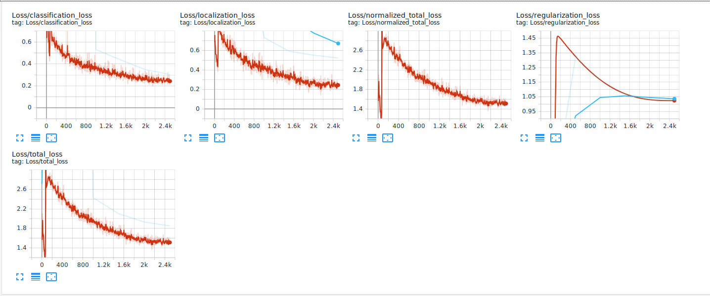
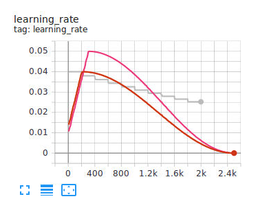
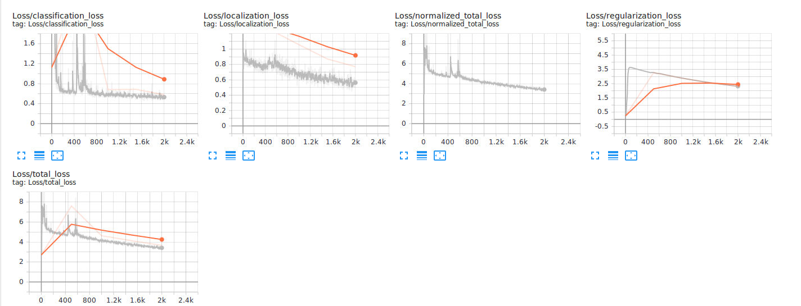
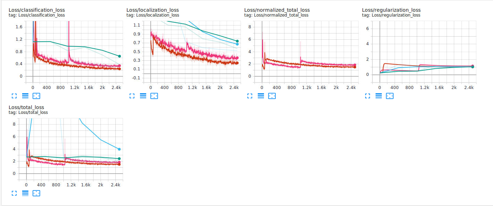
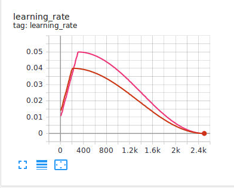

# Project overview
This project is showing a variety of method to train a neural network over a given dataset. The neural network is trained for object detection.
The objection detection module of a self driving vehicle is such an important module. This module help the vehicle to be aware of its surrounding. 
This way a vehicle can detect obstacle to avoid.

# Set up
To execute this training the provided workspace was used. 
All the different steps to execute this project can be found inside the file README.md

# Dataset
## Dataset analysis
This section should contain a quantitative and qualitative description of the dataset. It should include images, charts and other visualizations.

one image of the data set :




The dataset is composed by 1000 images from the waymo dataset. 



The first noticable fact is the vehicle/bicycle/pedestrian distribution their is a lot of cars and trucks but only a few bycicles and pedestrians. It would not be a surprise to see the model perform better with cars than with pedestrian and especialy bicycle.
Among the dataset we observe there is a good variety of weather and light conditions.

The following augmentions will be used to improve the size and variety in the data set: 
  - Brigthness
  - Contrast
  - Saturation
  - Hue
  - Black Patches

## Cross validation
For this project due to the smal amount of data (only 1000 images), the training data split will contain 80% of the images (800) and the validation data split will be composed by 20% (198). This is the Train-Test split strategy. The data is splitted randomly between the two sets. A few images will be used for test purpose between the 100 downloaded files 3 are disposed inside the test directory.
The split are considered before data augmentation.

# Training
## Reference experiment
As a reference experiment, the training was perform with the folowing parameter:

- optimizer: momentum optimizer
- steps: 2500
- learning rate: consine decay learning rate
- Data augmentation: Null

### Loss analysis

 

Analysis:

- the classification and localization losses don't seem to improve a lot across the training
- the regularization loss peak and then decrease to finaly stabelize.
- the validation curve doesn't show any overfit 
- the slow evolution of the regularization loss could come from the lack of data or the learning rate 

### learning

 

### Conclusion
This experiment 
The next experiments will focus on data augmentation and learning rate.

## Improve on the reference
### Data Augmentation
As the data set is quite small and fail to reflect some real life situation, data augmentation is used to improve the size and variety of the data set.

The training was perform with the folowing parameter:

- optimizer: momentum optimizer
- steps: 2500
- learning rate: consine decay learning rate
- Data augmentation: 
  - Brigthness
  - Contrast
  - Saturation
  - Hue
  - Black Patches
  
  
#### Image example
 

#### Graphs
As the learning remained unchanged, the learning rate won't be displayed here.

 

First the overall loss has significantly decreased compare to the initial experiment which proves that the data augmentation is effective and improving the object detection. The regularization loss has also the same shape than the reference. Another improvement is the stagnation of the classification loss which here seems to constantly decrease over the training. Which makes me think over increasing the number of steps or increase the learning rate. The same situation happen on the localisation loss.

The regularization loss show us that we still don't have any overfit with our model.

#### Conclusion 

Augmenting the volume and variety of data has greatly improve the training of our model by reducing the loss. Therefore it is still possible to improve the performances of the model. Two leads are the number of steps and the learning rate.

### Exponential decay Learning Rate

In the idea to experiment with training parameter we'll try an exponential learning rate instead of the cosine decay learning rate.

```
learning_rate: {
        exponential_decay_learning_rate {
              initial_learning_rate: 0.04
              decay_steps: 250
              decay_factor: 0.95
        }
```

The training was perform with the folowing parameter:

- optimizer: momentum optimizer
- steps: 2000
- learning rate: exponential decay learning rate
- Data augmentation: 
  - Brigthness
  - Contrast
  - Saturation
  - Hue
  - Black Patches

#### Graphs
The learning rate is shown on the following graph.
 

The idea was to get a higher learning rate with this model in order to improve the model.
The Loss charts show if we analyse the loss graph we can see that the the model keeps learning. Increasing the number of steps could be a great way to improve this model.

 

#### Conclusion
The exponential decay learning rate doesn't seem to add anything compare to the previous learning rate. The cosine decay learning rate is well know for being capable to avoid overfitting with the data. In the next experiment we'll test to tune the previous learning rate.

### Learning Rate Fine Tunning
As state in the following article the cosine decay rate is already a great learning rate for the object detection [Article](https://neptune.ai/blog/tensorflow-object-detection-api-best-practices-to-training-evaluation-deployment). So Instead of providing a new learning rate, the experiment will be with the same learning rate but with a different set of parameters.

**Initial experiment:**
```
 learning_rate {
        cosine_decay_learning_rate {
          learning_rate_base: 0.04
          total_steps: 2500
          warmup_learning_rate: 0.013333
          warmup_steps: 200
        }
```

**Experiment on learning rate:**
```
 learning_rate {
        cosine_decay_learning_rate {
          learning_rate_base: 0.05
          total_steps: 2500
          warmup_learning_rate: 0.01
          warmup_steps: 300
        }
```

The training was perform with the folowing parameter:

- optimizer: momentum optimizer
- steps: 2500
- learning rate: Fine tuned consine decay learning rate
- Data augmentation: 
  - Brigthness
  - Contrast
  - Saturation
  - Hue
  - Black Patches
#### Graphs
 

Incsreasing the learning rate caused a shift from one minimum to another and caused the weights to shift to a sub-optimal minimum.

 

This simply display the learning rates.

#### Conclusion

The higher learning rate made the model to skip from a minimum to another one and this minimum seemed to be sub-optimal. The next interation will focus on increasing the number of steps.

### Increase Steps Number experiment
The previous experiment and documentation showed that the learning rate was already close to an optimum and then following one of our previous experiment conclusion we will here increse the number of steps by 500.

The training was perform with the folowing parameter:

- optimizer: momentum optimizer
- steps: 3000
- learning rate: Fine tuned consine decay learning rate
- Data augmentation: 
  - Brigthness
  - Contrast
  - Saturation
  - Hue
  - Black Patches
#### Conclusion
The workspace is lacking memory for excecuting this experiment.

# Conclusion

At the end of all these experiment we can say that we could test and try some improvement on the training process. In the end our best training setup will have the following parameters:


- optimizer: momentum optimizer
- steps: 2500
- learning rate: consine decay learning rate
- Data augmentation: 
  - Brigthness
  - Contrast
  - Saturation
  - Hue
  - Black Patches

Of course this could be improve but at the cost of a lot of time and effort.